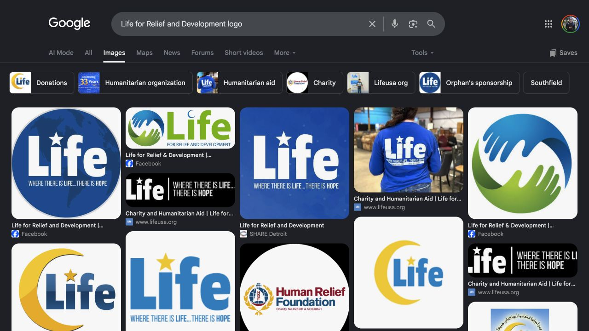
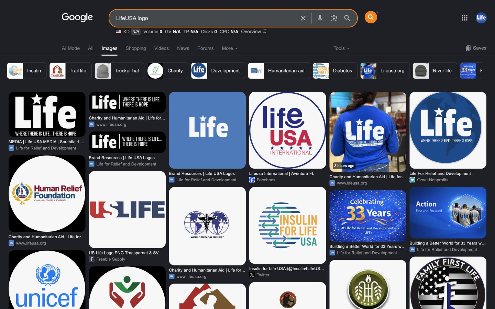
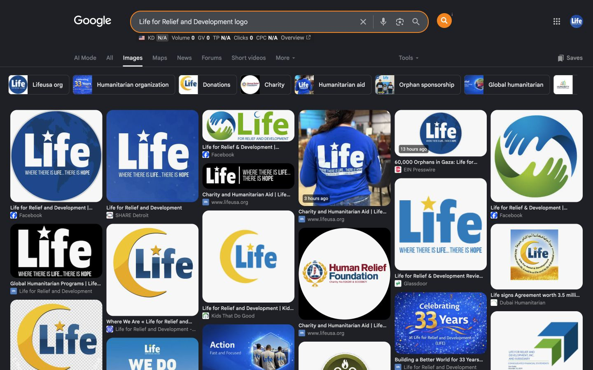

# Google Images query verification — August 12, 2026

This is an ad-hoc query comparison, not a complete scheduled monitoring run. It does not increment the three-check stability counter.

## Controlled setup

- Browser profile: LifeUSA Chrome profile selected by the user
- Surface: Google Images
- Language: English (`hl=en`)
- Country: United States (`gl=us`)
- Personalization parameter: disabled (`pws=0`)
- Checked: August 12, 2026

## Query results

| Exact query | First visible result set | Status |
|---|---|---|
| `LifeUSA logo` | No retired yellow-crescent LifeUSA logo was observed. Relevant leading results included current LifeUSA website, media, homepage, and Brand Resources assets. Unrelated same-name entities were also present. | **Query-level win** |
| `Life for Relief and Development logo` | Retired yellow-crescent results remained visible, including Kids That Do Good and the old LifeUSA WordPress archive. Current LifeUSA and approved blue-globe results were also present. | **Still under monitoring** |

## August 12 screenshots

### July 21 historical benchmark

This benchmark remains part of the evidence so the August 12 results can be compared with the earlier state.

### `LifeUSA logo` — query-level win

### `Life for Relief and Development logo` — still under monitoring

Repeatable URLs:

- `https://www.google.com/search?q=LifeUSA+logo&hl=en&gl=us&pws=0&udm=2`
- `https://www.google.com/search?q=Life+for+Relief+and+Development+logo&hl=en&gl=us&pws=0&udm=2`

## Interpretation

The clean first visible result set for `LifeUSA logo` is a real query-level improvement. It does not prove that Google has fully retired the old logo because the benchmark query still surfaces legacy results and the underlying Kids That Do Good and WordPress source pages remain unresolved.

The program remains open and the scheduled stable-check count remains **0 of 3**.
